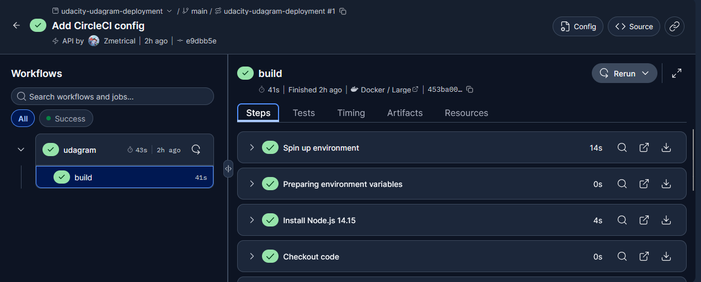
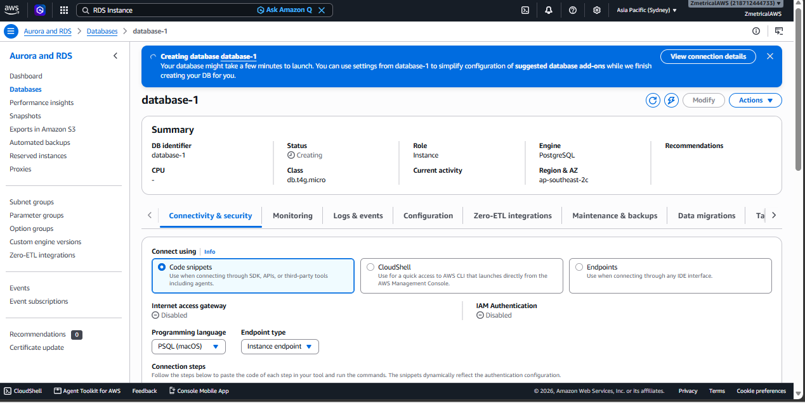
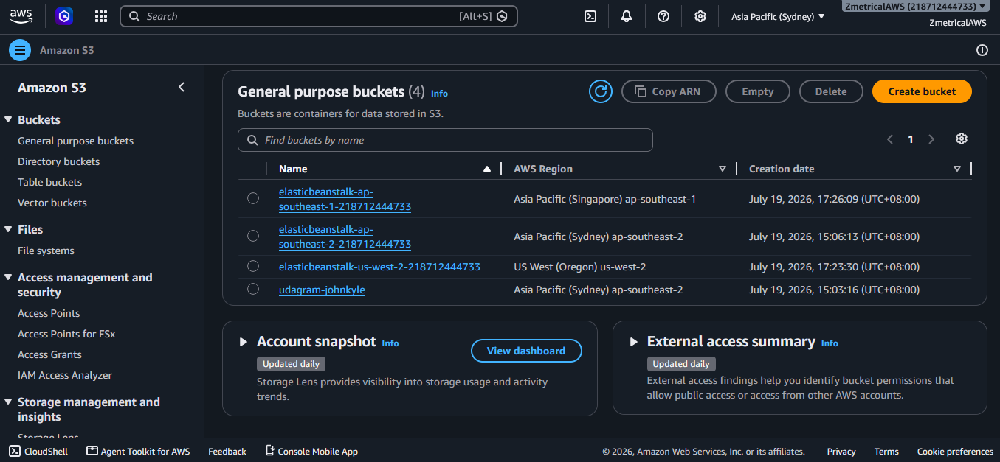
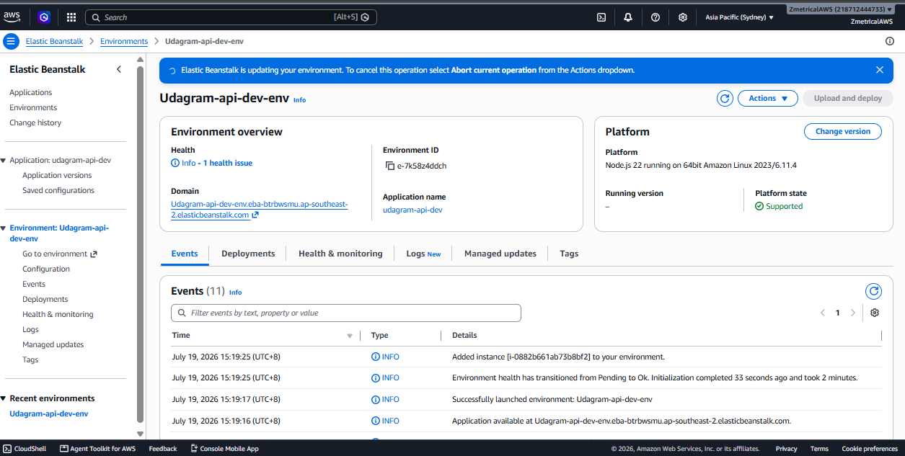
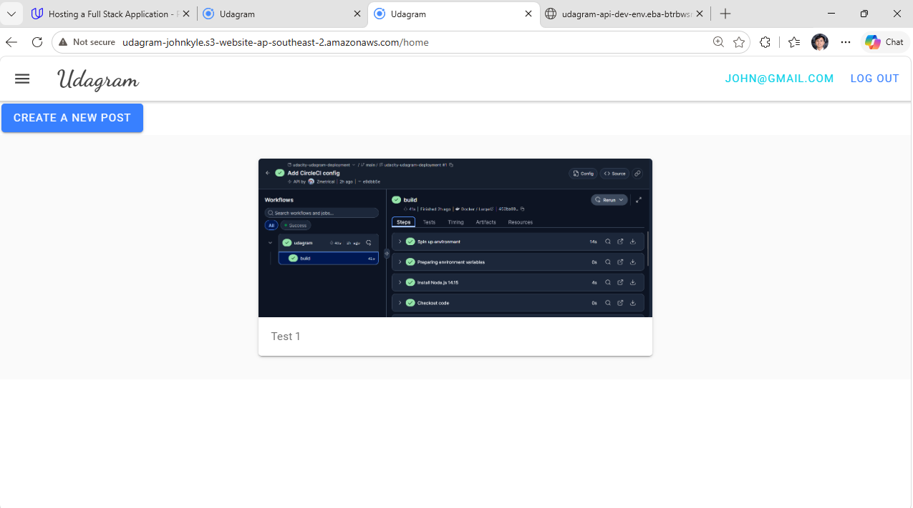

# Udagram Deployment Project

## Project Overview

Udagram is a full-stack image sharing application.

The application consists of:

- Angular/Ionic frontend
- Node.js/Express backend API
- PostgreSQL database hosted on Amazon RDS
- Frontend hosting using Amazon S3
- Backend hosting using AWS Elastic Beanstalk
- CI/CD pipeline using CircleCI

---

## Application URLs

### Frontend URL

[Udagram Frontend](http://udagram-johnkyle.s3-website-ap-southeast-2.amazonaws.com/)

### Backend URL

[Udagram Backend API](http://udagram-api-dev-env.eba-btrbwsmu.ap-southeast-2.elasticbeanstalk.com/)

---

## Infrastructure Overview

The project uses the following cloud services:

### Amazon S3

Hosts the frontend application.

### AWS Elastic Beanstalk

Hosts the backend API.

### Amazon RDS PostgreSQL

Stores application data.

### CircleCI

Automates build and deployment.

---

## Environment Variables

The project uses environment variables instead of hardcoded credentials.

Variables include:

- POSTGRES_HOST
- POSTGRES_DB
- POSTGRES_USERNAME
- POSTGRES_PASSWORD
- POSTGRES_PORT
- AWS_BUCKET
- AWS_REGION
- JWT_SECRET
- URL

---

## Deployment Process

1. Push source code to GitHub.
2. CircleCI pipeline starts automatically.
3. Frontend is built.
4. Backend is built.
5. Frontend is deployed to Amazon S3.
6. Backend is deployed to Elastic Beanstalk.
7. Backend connects to Amazon RDS.

---

## Dependencies

### Frontend

- Angular 8
- Ionic
- TypeScript

### Backend

- Node.js
- Express
- Sequelize
- PostgreSQL

### Cloud Services

- Amazon S3
- Amazon RDS
- Elastic Beanstalk
- CircleCI

---

## Required Screenshots

### CircleCI Successful Build

### Amazon RDS

### Amazon S3

### Elastic Beanstalk

### Working Application

---

## Docs Folder Artifacts

- [Infrastructure Description](docs/Infrastructure_description.md)
- [Pipeline Description](docs/Pipeline_description.md)
- [Application Dependencies](docs/Application_dependencies.md)
- [Architecture Diagram](docs/architecture-diagram.md)
- [Pipeline Diagram](docs/pipeline-diagram.md)

---

## Author

John Kyle Bersamina