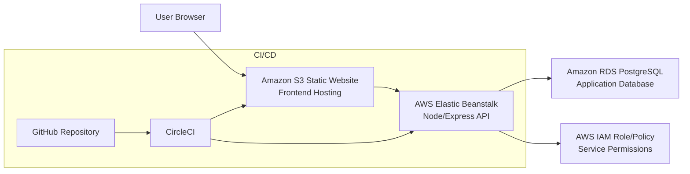

# Architecture Diagram

## Notes

- Frontend is hosted as static assets in S3 website hosting.
- Backend API is deployed to Elastic Beanstalk.
- API persists data in RDS PostgreSQL.
- CircleCI builds and deploys both frontend and backend from GitHub commits.
