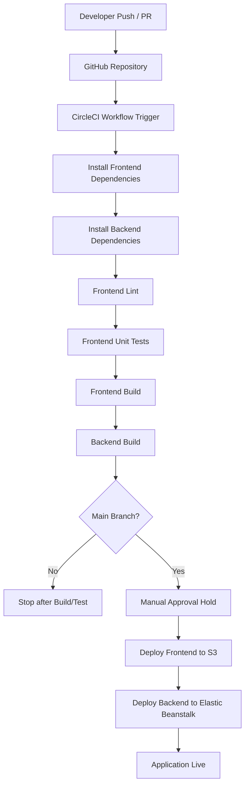

# Pipeline Diagram

```mermaid
flowchart TD
    A[Developer Push / PR] --> B[GitHub Repository]
    B --> C[CircleCI Workflow Trigger]

    C --> D[Install Frontend Dependencies]
    D --> E[Install Backend Dependencies]
    E --> F[Frontend Lint]
    F --> G[Frontend Unit Tests]
    G --> H[Frontend Build]
    H --> I[Backend Build]

    I --> J{Main Branch?}
    J -- No --> K[Stop after Build/Test]
    J -- Yes --> L[Manual Approval Hold]
    L --> M[Deploy Frontend to S3]
    M --> N[Deploy Backend to Elastic Beanstalk]
    N --> O[Application Live]
```

## Notes

- All branches run build validation.
- Main branch requires manual approval before deployment.
- Deployment publishes frontend to S3 and backend to Elastic Beanstalk.
